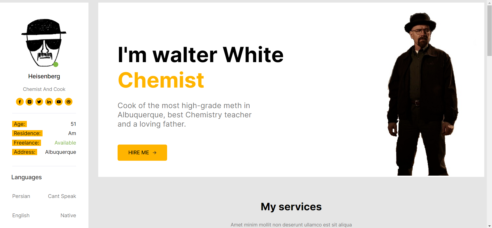

## Portfolio With Html And Css

The current project is a responsive portfolio template. it contains parts for the work history, services and education of the user. it also has a side-bar that contains a sum of all the different informatin needed about the individual and a part for downloading the CV. the template is responsive. if the screen becomes smaller, the side-bar goes to the bottom of the page and the main-bar and the other parts move to the middle.
